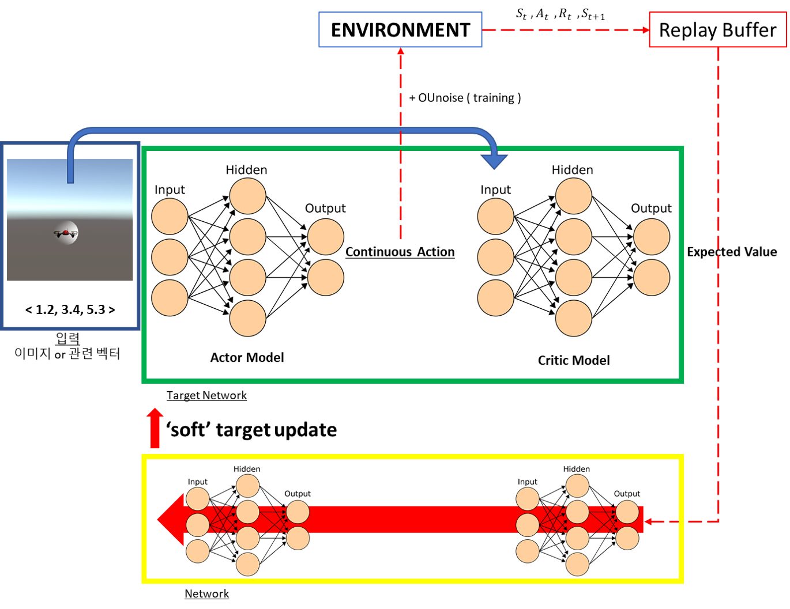

# Continous control with deep reinforcement Learning

연속적인 값이 action인 환경(Cartpole etc)에 대한 학습을 수행하기 위해 [Continous control with deep reinforcement Learning](https://arxiv.org/pdf/1509.02971.pdf) 논문에서 제안한 Deep deterministic policy gradient (DDPG) 알고리즘에 대해 알아보고 코드를 구성해볼 것입니다.

이 문서를 통해 우리가 배우고자 하는 것

- DDPG 알고리즘 개요
- DDPG 알고리즘의 기법들
- DDPG 학습
- DDPG 코드

## 0. 들어가기 전 한줄 용어

- Policy Gradient

확률적인 Policy를 찾습니다. (DQN은 deterministic) [details](https://reinforcement-learning-kr.github.io/2018/06/28/1_sutton-pg/)

- Actor-Critic method

Actor 모델이 Q value를 찾으면서 Critic 모델이 policy를 찾습니다. [details](https://jay.tech.blog/2017/01/04/policy-gradient-methods-part-2/) [details 2](https://medium.freecodecamp.org/an-intro-to-advantage-actor-critic-methods-lets-play-sonic-the-hedgehog-86d6240171d)

## 1. Deep deterministic policy gradient (DDPG) 개요

연속적인 값에 대한 행동(로봇 모터 제어 등)을 배우는 DDPG 알고리즘도 Deepmind 팀에서 발표한 연구입니다. 기존의 이산적인(Discrete) 행동을 넘어 연속적인 값에 대한 action을 심층 강화학습을 통해 학습시켰다는 점이 개선점이라고 볼 수 있습니다. [video](https://www.youtube.com/watch?v=tJBIqkC1wWM&feature=youtu.be)

**Figure 1**: **DDPG 전체 구조**

**Figure 1**을 통해 DDPG 알고리즘의 전체 흐름을 볼 수 있습니다. 특정 state가 주어지면 actor model이 그에 맞는 continuous action을 예측하고 그 action을 environment에서 수행한 후 해당 값을 critic model에서 검증합니다.

학습 과정일 시에는, *OU Noise*와 *Replay Buffer*, *soft target update* 개념을 통해 네트워크를 효과적으로 학습합니다.

DDPG에서 주목할 만한 점은 논문에서 주장하길, state를 이미지 혹은 vector정보를 주어도 큰 차이가 없었다는 점입니다. 

## 2. DDPG 알고리즘의 학습 기법들

### 1) Expereince Replay

DQN의 Expereicne Replay를 참고해주세요.

### 2) OU Noise

[Ornstein-Uhlenbeck process](https://en.wikipedia.org/wiki/Ornstein%E2%80%93Uhlenbeck_process)는 continous 공간에 대한 효과적인 랜덤성을 부여하기 위한 방법입니다. 단순한 random보다는 pre-state의 방향성과 관련된 noise를 부여하여 안정적인 탐색을 하였습니다.

### 3) Soft Actor-Critic

continous action space에 Q Learning을 그대로 적용하면 최적화 과정이 매우 느립니다. 이를 해결하기 위하여 Actor-Critic 구조를 사용하여 학습합니다. 이를 통해 continous action player 환경을 쉽게 학습할 수 있습니다.

기존의 deterministic policy gradient (DPG)에 신경망을 적용할 때에는 online 학습보다는 각 데이터의 독립성을 보장하기 위해 minibatch 학습이 적합합니다.

DDPG의 actor-critic를 업데이트 할때에는 DQN의 **target network** 학습 방법으로 진행됩니다. 